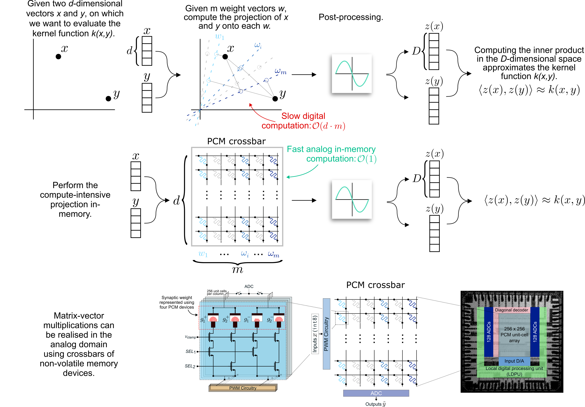

# Kernel Approximation using Analog In-Memory Computing

#### Julian Büchel, Giacomo Camposampiero, Athanasios Vasilopoulos, Corey Lammie, Manuel Le Gallo, Abbas Rahimi, and Abu Sebastian

Nature Machine Intelligence, 2024 [[Article]](https://www.nature.com/articles/s42256-024-00943-2) [[Preprint]](https://arxiv.org/abs/2411.03375)

***

<div align="center">
  
</div>

***

This repository contains the implementation of in-memory kernel approximation for linear regression models and linear-complexity Transformer models. Details and instructions can be found in the corresponding folder.

**Note:**
We recommend to re-format the codebase before starting working on it. To do so, please use
```bash
black imka-lra
black imka-ridge-regression
```

## Citation 📚
If you use the work released here for your research, please consider citing our paper:
```
@article{buchel2024kernel,
  title={Kernel approximation using analogue in-memory computing},
  author={B{\"u}chel, Julian and Camposampiero, Giacomo and Vasilopoulos, Athanasios and Lammie, Corey and Le Gallo, Manuel and Rahimi, Abbas and Sebastian, Abu},
  journal={Nature Machine Intelligence},
  pages={1--11},
  year={2024},
  publisher={Nature Publishing Group}
}
```


## License 🔏
Please refer to the LICENSE file for the licensing of our code.

